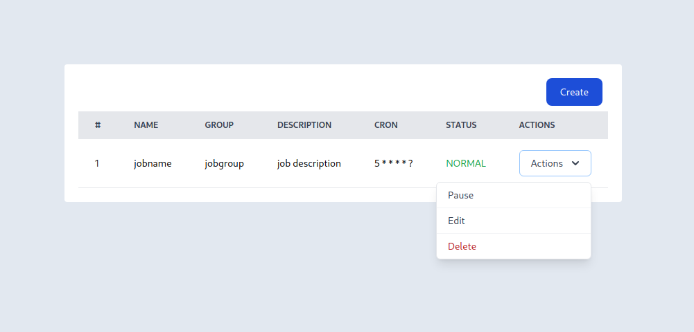
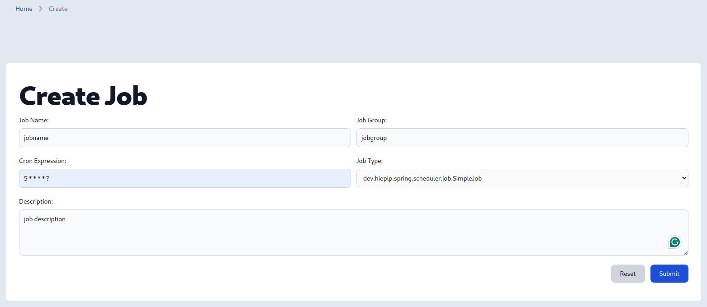
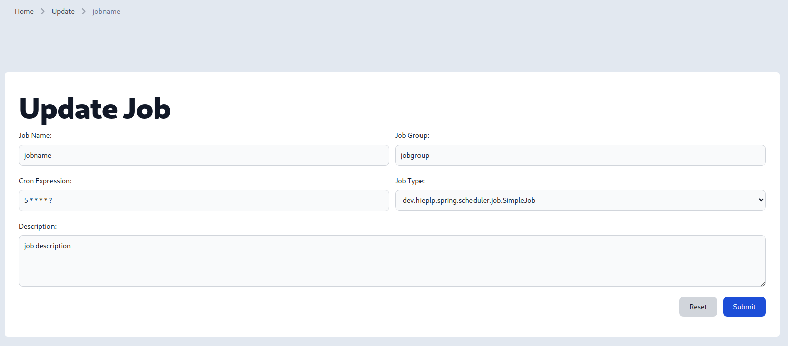

# dynamic-spring-quartz-scheduler

### Description

This project is a simple example of how to use the Quartz Scheduler in a Spring Boot application.

### Technologies

- Java 21
- Spring Boot
- Quartz Scheduler
- Gradle
- Thymeleaf
- Tailwind CSS

### Images

### References

- [Dynamic-Job-Scheduling-with-Quartz-and-SpringBoot](https://github.com/Suryakanta97/Dynamic-Job-Scheduling-with-Quartz-and-SpringBoot)
